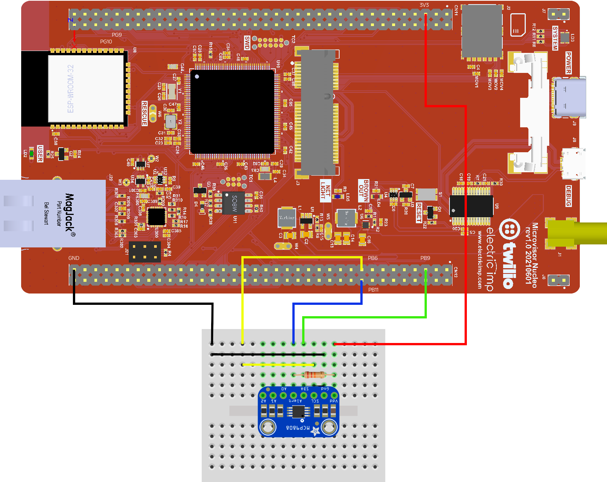

# Microvisor Native FreeRTOS Demo

This repo provides a basic demonstration of user application firmware based on the [FreeRTOS](https://freertos.org/) real-time operating system and which will run on the “non-secure” side of Microvisor.

Unlike [our primary FreeRTOS demo](https://github.com/twilio/twilio-microvisor-freertos), this code does not use [ARM CMSIS-RTOS API](https://github.com/ARM-software/CMSIS_5) as an intermediary between the application and FreeRTOS. Instead, it uses native FreeRTOS calls.



Do demostrate native FreeRTOS operation, the code uses an MCP9808 temperature sensor breakout to provide a thermal readout every 15 seconds. If the ambient temperature rises above 30°C (set in `main.h`), the MCP9808’s ALERT pin asserts, triggering an interrupt on the Microvisor Nucleo Development Board’s PB11 pin. FreeRTOS’ task notification mechanism is used to signal a specific task from the Interrupt Service Routine (ISR) to light the USER LED (it blinks periodically otherwise). 

FreeRTOS’ timer mechanism is used periodically to check for the end of the alert condition: if the temperature has fallen below 30°C, the alert is over, otherwise a new timer is set to check again in 20 seconds' time.

The MCP9808 alert pin is free-floating and must be connected to 3V3 via a pull-up resistor, such as 22k&omega;. An alert will pull this low; the falling signal is detected as an interrupt trigger on the SMT32U585 GPIO pin (PB11) connected to the MCP980 alert pin.

Most of the project files can be found in the [Demo/](Demo/) directory. The [ST_Code/](ST_Code/) directory contains required components that are not part of the Microvisor STM32U5 HAL, which this code accesses as a submodule. FreeRTOS is also incorporated as a submodule. The `FreeRTOSConfig.h` configuration file is located in the [Config/](Config/) directory.

## Build with Docker (macOS)

Build the image:

```shell
docker build --build-arg UID=$(id -u) --build-arg GID=$(id -g) -t microvisor-freertos-image .
```

Run the build:

```shell
docker run -it --rm -v $(pwd)/:/home/mvisor/project/ \
  --env-file env.list --name microvisor-freertos microvisor-freertos-image
```

Under Docker, the demo is compiled, uploaded and deployed to your development board. It also initiates logging — hit <b>ctrl</b>-<b>c</b> to break out to the command prompt.

## Build at the Command Line (Ubuntu, Windows Subsystem for Linux)

**Note** If you are running under Windows, please first install [Windows Subsystem for Linux](https://learn.microsoft.com/en-us/windows/wsl/install). This requires admin privileges. When you’re done, run Ubuntu from the **Start** menu.

### Install Libraries and Tools

```shell
sudo apt install gcc-arm-none-eabi binutils-arm-none-eabi \
  git curl build-essential cmake libsecret-1-dev jq openssl
```

### Install Twilio CLI

**Note** If you have already installed the Twilio CLI using *npm*, we recommend removing it and then reinstalling as outlined below. Remove the old version with `npm remove -g twilio-cli`.

```shell
curl -s https://twilio-cli-prod.s3.amazonaws.com/twilio_pub.asc | sudo apt-key add -
sudo touch /etc/apt/sources.list.d/twilio.list
echo 'deb https://twilio-cli-prod.s3.amazonaws.com/apt/ /' | sudo tee /etc/apt/sources.list.d/twilio.list
sudo apt update
sudo apt install -y twilio
```

Close your terminal window or tab, and open a new one. Now run:

```shell
twilio plugins:install @twilio/plugin-microvisor
```

### Set Environment Variables

Running the Twilio CLI and the Microvisor Plugin to upload and deploy code to your Microvisor Nucleo Board requires the following Twilio credentials stored as environment variables. They should be added to your shell profile (e.g., `.bashrc`):

```shell
export TWILIO_ACCOUNT_SID=ACxxxxxxxxxxxxxxxxxxxxxxxxxxxxxxxx
export TWILIO_AUTH_TOKEN=xxxxxxxxxxxxxxxxxxxxxxxxxxxxxxxx
export MV_DEVICE_SID=UVxxxxxxxxxxxxxxxxxxxxxxxxxxxxxxxx
```

You can get the first two from your Twilio Console [account dashboard](https://console.twilio.com/).

Your target device’s SID is accessible via the QR code on the back of your development board. Scan the code with your mobile phone and a suitable app, and the board’s SID is the third `/`-separated field.

### Configure Twilio CLI

```shell
twilio login
```

You will need to enter your Account SID and Auth Token. Make sure you note your profile name, which the CLI will invite you to specify. Now run:

```shell
twilio profiles:use <YOUR_PROFILE_NAME>
```

### Build and Deploy the Demo

```shell
git clone https://github.com/korewireless/Microvisor-Demo-Native-Freertos
cd Microvisor-Demo-Native-Freertos
twilio microvisor:deploy . --devicesid ${MV_DEVICE_SID} --log
```

This will compile, bundle and upload the code, and stage it for deployment to your device. If you encounter errors, please check your stored Twilio credentials.

The `--log` flag initiates log-streaming.

Power on your NDB if it is not already operating.

#### View Log Output

You can start log streaming without first building and/or deploying new code with this command:

```shell
twilio microvisor:deploy . --devicesid ${MV_DEVICE_SID} --logonly
```

For more information, run:

```shell
twilio microvisor:deploy --help
```

## Repo Updates

Update the repo’s submodules to their remotes’ latest commits with:

```shell
cd /path/to/microvisor-native-freertos-demo
git submodule update --remote --recursive
```

## More Samples

Please see [Microvisor Sample Code](https://www.twilio.com/docs/iot/microvisor/sample-code).

## Copyright

The sample code is © 2023, KORE Wireless, Inc. It is licensed under the terms of the MIT License.

FreeRTOS is © 2021, Amazon Web Services, Inc
